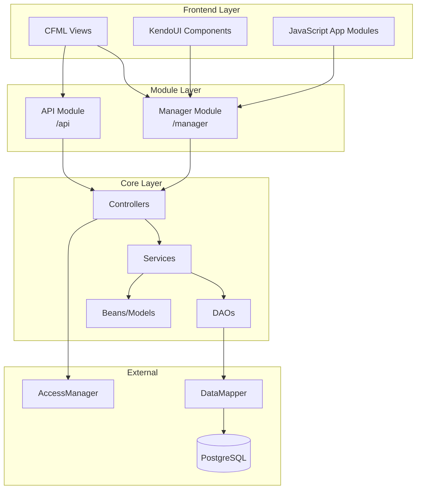
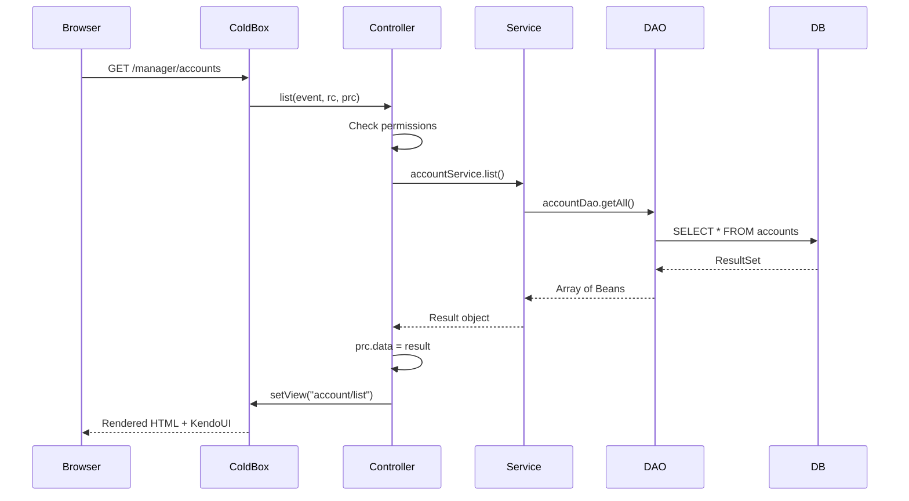
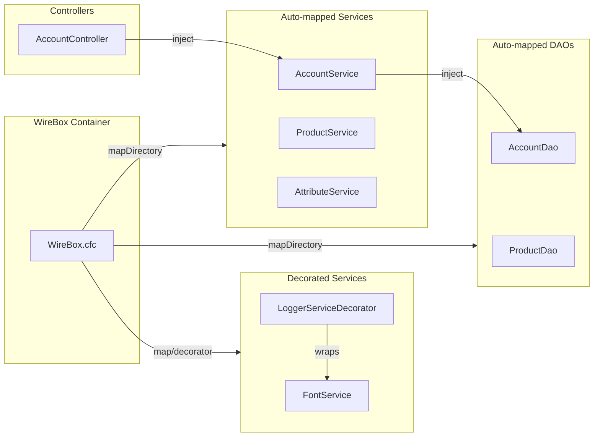
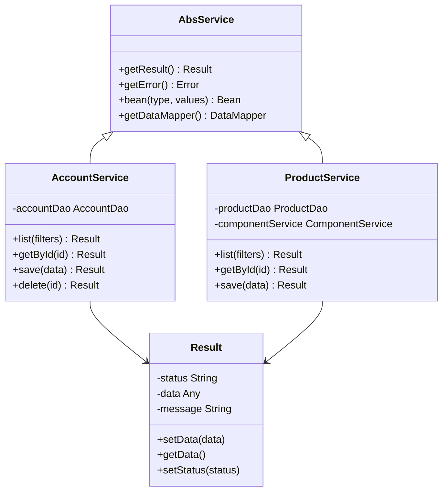
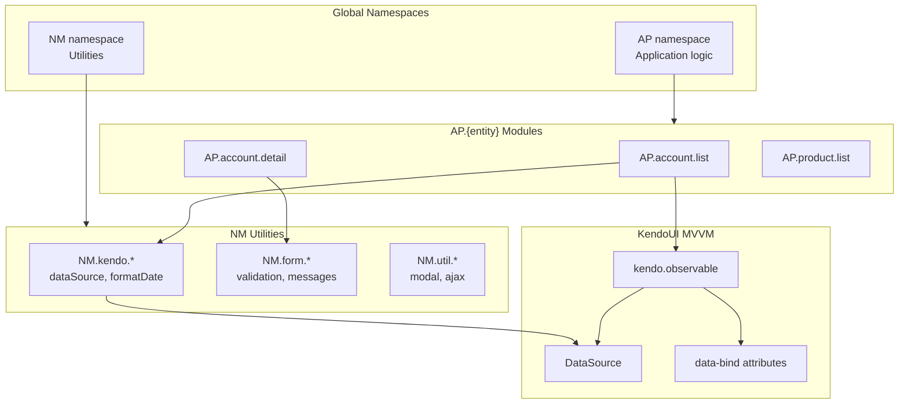
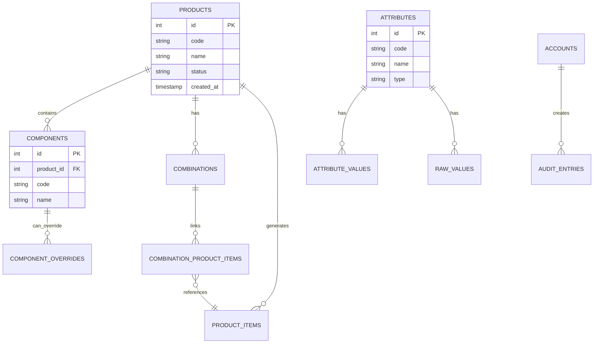
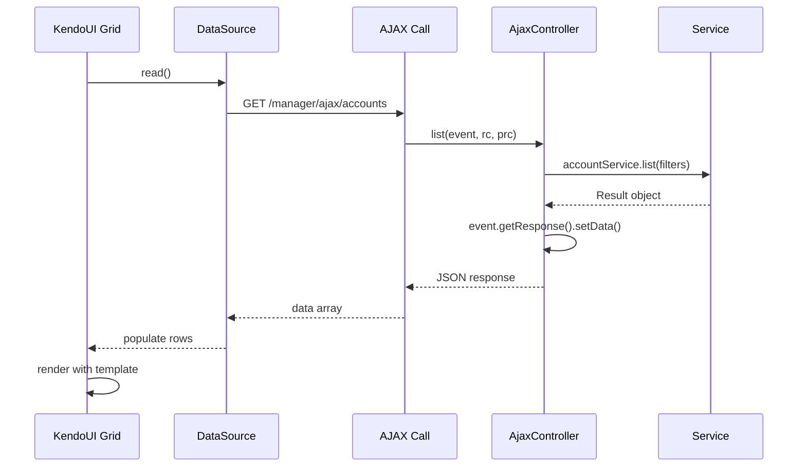
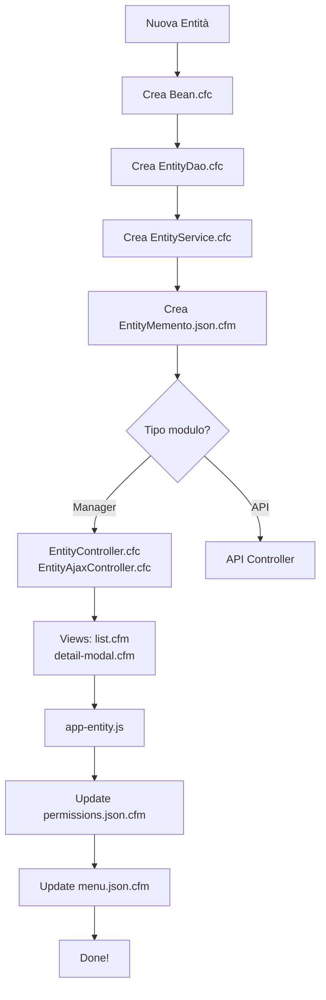

# ApirOne - Architecture Diagrams

Questo file contiene diagrammi Mermaid per visualizzare l'architettura del progetto.

## Architettura a 3 Livelli

## Flusso Richiesta HTTP (Manager Module)

## Dependency Injection (WireBox)

## Pattern Service Layer

## Frontend Architecture (JavaScript)

## Database Schema (Esempio Entità Principali)

## Flusso AJAX (KendoUI DataSource)

## Workflow Aggiunta Nuova Entità

---

**Nota:** VS Code renderizza automaticamente i diagrammi Mermaid. Se non li vedi, assicurati di avere l'anteprima Markdown attiva (Ctrl+Shift+V o click sull'icona preview).
